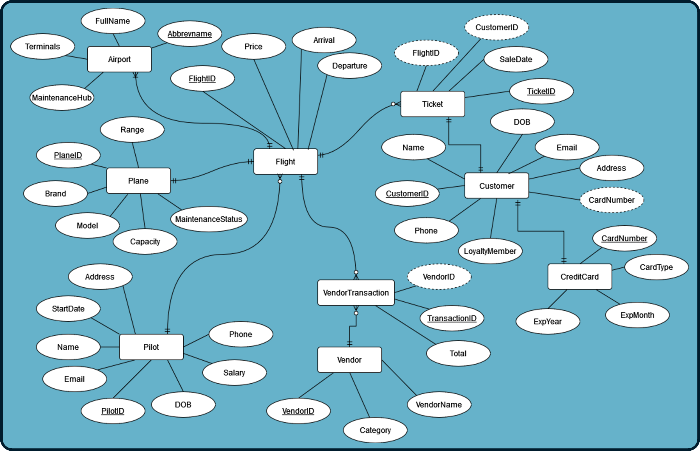

# BudgetAirlines_SQL
Portfolio project - Construction of mock Database in SQL - Produced insightful SQL queries on the state of certain facets of the company

## Implementation Challenge
Budget Airlines is implementing a DBMS solution to track their flights and associated datapoints to reduce reliance on redundant siloed data repositories and spreadsheets. With multiple unique entities from pilots, to passengers, to vendors, to tickets, combining all records into one repository will allow for ease of access and quicker reporting times and more accurate reporting results.

## Organization Overview
Budget airlines is a small airline flight operator that serves US domestic passengers. So far they have expanded to five major airports and manage a fleet of fifteen Boeing 737s. They employ eleven pilots directly to man the flights and all other flight & airport staff are managed through vendors. 

## Database Scope
### Airports
Records are maintained for all airports Budget Airlines operates out of. This includes information on the recognized unique three letter abbreviated name, how many terminals are available for use and docking, and whether or not that particular airport is available as a service hub for Budget Airlines via one of their vendors.

### Planes
Budget Airlines maintains records respective to their fleet of 737s, including a unique identifier, the make and model info, the airplane range, capacity, and current maintenance status as of May 2022.

### Pilots
Pilot records are stored via employee records, not included in the scope of this implementation, but are referenced since pilots are the only airline staff directly involved in flights that are not employed and managed by third party vendors. Records included are relevant to unique pilot identifiers, names, start dates, salaries, dates of birth, and contact info.

### Flights
For testing purposes of this implementation, flight data includes ten flights that were recorded in April 2022. Records include unique flight identifiers, information on departure and arrival dates, locations, and times, the plane used for the flight, payments to fuel, food, maintenance, and staffing vendors, and individual ticket price.

### Tickets
Tickets sold for each of the aforementioned flights have also been included, recording the specific ticket identifier, the particular flight, the purchasing customer, and sale date of the ticket.

### Customers
Customer information for ticket sales includes unique customer identifiers, customer names, dates of birth, emails, loyalty status, contact information, and credit card numbers.

### Credit Cards
Data for customer credit card records includes unique credit card numbers, card issuers (Visa, MasterCard, Amex, etc), and expiration  month and year.

### Vendors
Stored vendor information includes the assigned vendor identifier, vendor name, and respective accounting category (fuel, food, maintenance, or staffing).

### Vendor Transactions
Records for the forty vendor transactions relevant to the previously mentioned flights, which includes the transaction identifier, vendor identifier, and transaction total for each transaction.

## ERD

### Relational Data Model

